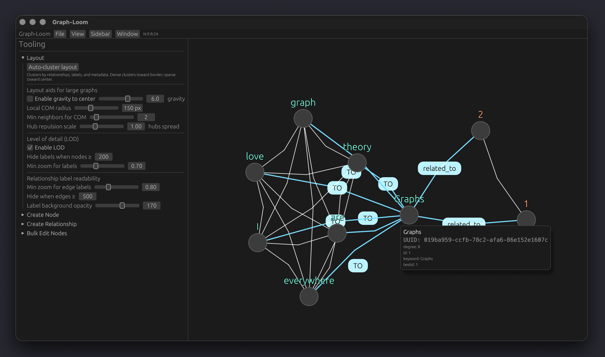
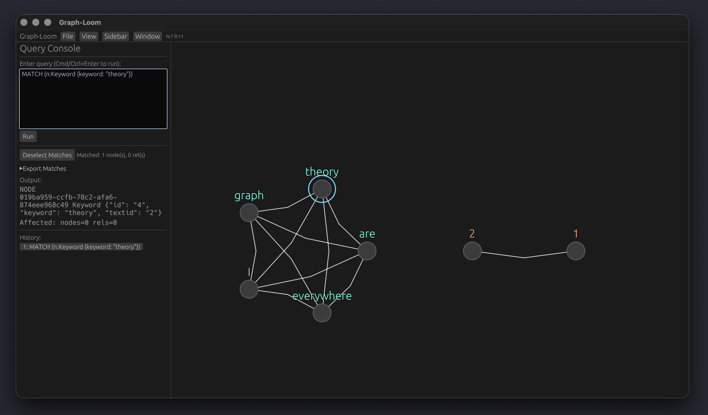
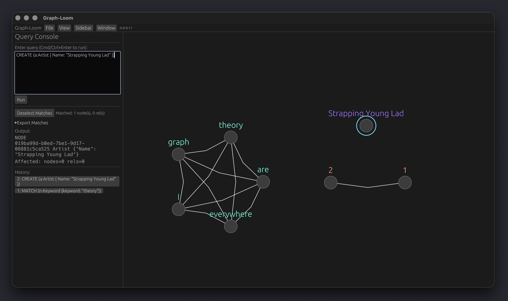

# GraphDB Note App (Rust): "Graph-Loom"

## Overview

Graph-Loom is a lightweight, local-first graph notebook and visualizer built with Rust + egui. It lets you create nodes and relationships, view them on a canvas, and interactively arrange them with a smooth, physics-assisted layout. A pragmatic OpenCypher-like query console supports creating, matching, and deleting graph elements (with parameters, ORDER BY, SKIP/LIMIT, and more).


---

## Key Features

- Auto-cluster layout
  - Community detection clusters nodes by: relationships, label similarity, and metadata overlap.
  - Well-formed clusters are placed toward the border; sparsely connected/outlier nodes gravitate toward the center for readability.

- Large-graph visual aids (Neo4j-style)
  - Gravity-to-center and degree-aware repulsion to keep components cohesive while spreading hubs.
  - Level-of-detail (LOD) rendering for hundreds of nodes: adaptive edge opacity, label hiding when zoomed out or in very large graphs, and dynamic font scaling.
  - Hover/selection emphasis: highlight incident edges/nodes and dim non-neighbors for quick local context.
  - Slightly curved edges to separate overlapping/parallel links; relationship labels offset from edges for clarity.
  - Configurable in Sidebar → Layout (LOD toggle, thresholds, and zoom cutoff).

  

- No-overlap guarantee
  - A fast post-layout resolver separates nodes to a minimum spacing so they never render on top of each other.

- Smooth motion with a 3s settle window
  - Spring–damper physics for edges and soft repulsion for nearby nodes yield natural movement.
  - “Soft dragging” pulls a node toward the cursor with a spring (neighbors flow out of the way) instead of hard snapping.
  - All motion automatically halts 3 seconds after the last layout/drag change.

- Responsive window resizing & robust top bar
  - The UI and canvas adapt to smaller or larger window sizes.
  - Tool sidebars are scrollable on small windows; the graph view recenters to keep content stable when resizing.
  - Top bar uses compact drop-down menus so actions remain accessible even on very narrow windows.

- Practical persistence
  - State is saved to assets/state.ron and loaded on startup. If no state exists, a blank graph is created.
  - File → New Graph creates an empty graph and saves a versioned backup of the current graph first (if non-empty).

- Clean UI grouping
  - The left sidebar groups tools into collapsible sections (collapsed by default on startup): Layout, Create Node, Create Relationship, Bulk Edit Nodes.

- Query logging
  - Executed queries are logged to assets/logs/queries_YYYYMMDD.log with basic status info.
  
  

- Rectangle multi-selection (Bulk Edit)
  - In Tooling → Bulk Edit Nodes, click “Start Selecting” and drag a rectangle on the canvas to select many nodes at once. Toggle nodes by clicking while in this mode. Use the Bulk Edit actions to upsert/delete metadata or delete selected nodes.

### Embedded API Service (optional)

Graph-Loom can expose a lightweight HTTP/WebSocket API for remote interaction, similar to a database REPL.

- Enabling: open Settings → Preferences… → "API Service (Actix)" and toggle "Enable API Server". Configure bind address, port, and an optional API key.
- Default bind: 127.0.0.1:8787
- Authentication: if an API key is configured, include header `X-API-Key: <your key>` with requests.
- Endpoints:
  - POST /api/query
    - Body (JSON): `{ "query": "...", "params": {"k":"v"}, "log": true }`
    - Returns: JSON with rows and counts reflecting the same outcome the in-app console produces.
    - Example using jq to format the results:
```bash
  curl -X POST http://127.0.0.1:8787/api/query \
       -H 'Content-Type: application/json' \
       -d '{"query":"MATCH (n) RETURN n LIMIT 5"}' | jq '.'
```
  - GET /api/repl (WebSocket)
    - After connect, send text messages where each message is a query; responses are JSON results per message.

Note: The API feature is enabled by default in builds of the app and controlled at runtime via Preferences. On first enable, the server starts within the running app; changes to bind/port require the server to restart (the app does this automatically on Save).

#### API traffic logging
- All API traffic (HTTP and WebSocket) is logged to daily files under a configurable directory.
- Default directory: {OS temp}/Graph-Loom/api-logs (e.g., /tmp/Graph-Loom/api-logs on Unix/macOS).
- Configure in Settings → Preferences → "API Service (Actix)" → "API log directory". Leave empty to use defaults.
- Log format (one line per event): `YYYY-MM-DD HH:MM:SS | <event>` where events include server start, HTTP requests and results, WebSocket connects/queries/results, timeouts, and errors.

### Headless Background Mode
Graph-Loom can run without its GUI frontend, allowing it to act as a pure graph database server.

- **Enabling:** Run the application with the `--background` or `-b` flag.
  ```bash
  ./Graph-Loom --background --api-enable
  ```
- **Behavior:**
  - No window will be shown.
  - The API and gRPC servers will start based on your current settings or CLI overrides.
  - Graph state is loaded on startup and periodically autosaved if changed.
  - Press `Ctrl+C` in the terminal to stop.
- **Background on Close:**
  - You can enable "Continue running in background when window is closed" in **Settings → Preferences → App Settings**.
  - This allows you to background the frontend while the backend stays active, similar to Docker Desktop. (Note: Currently requires launching with background support or as a persistent process).

### CLI client (optional): glsh

Graph-Loom includes an optional command-line client glsh (Graph-Loom Shell) to connect to the API WebSocket REPL.

- Build: `cargo build --features cli --bin glsh`
- Connect: `target/debug/glsh --host 127.0.0.1 --port 8787`
- With API key: `target/debug/glsh --host 127.0.0.1 --port 8787 --api-key <KEY>`
- One-off evaluation: `glsh -e "MATCH (n) RETURN n LIMIT 2"`
- Example output (truncated):
```text
  Connected to ws://127.0.0.1:8787/api/repl.
  Type queries and press Enter. Commands: :help, :quit. History saved at /Users/simsjo/Library/Application Support/Graph-Loom/glsh_history.txt.
  
  glsh> MATCH (n) RETURN n LIMIT 5;
  {
    "affected_nodes": 0,
    "affected_relationships": 0,
    "mutated": false,
    "rows": [
      {
        "id": "019bfb2b-d43e-76b0-87c2-1ddd60935f9c",
        "kind": "node",
        "label": "test",
        "metadata": {}
      }
      ...
```
- Interactive mode supports line editing and history (stored under the app’s settings directory).

---

## Getting Started

Prerequisites

- Rust toolchain (stable): https://www.rust-lang.org/tools/install

---

## Build and Run

- Debug: cargo run
- Release: cargo run --release

On first launch, if assets/state.ron is missing, you’ll start with an empty graph. Subsequent runs will load the saved state automatically.

---

## Using the App

- Panning/zooming & resizing
  - Zoom only applies when your cursor is over the graph canvas. Scrolling in the left sidebar or other UI panels will not change the graph zoom.
  - Drag the canvas background (or use middle mouse) to pan.
  - The window is fully resizable; when you resize, the canvas adjusts and attempts to keep the view stable. If you end up off-screen on very small windows, use "Reset View" in the top bar or pan back into view.

- Creating nodes
  - Sidebar → Create Node: choose a label and optional metadata key/value pairs, then Create. New nodes are rendered immediately (no auto pop-out).
  - Optionally, you can pre-link a relationship while creating a node when the UI offers that nested option.

- Creating relationships
  - Sidebar → Create Relationship: select a source and destination node and label; optionally add metadata. The new edge renders immediately.

- Arranging the graph
  - Sidebar → Layout → Auto-cluster layout re-runs the community layout on all nodes.
  - Drag nodes directly; neighbors will adjust smoothly. Motion stops after 3s unless you drag again or re-layout.

  

- Exporting
  - Export query matches or the entire graph as JSON or CSV from the Sidebar (Query → Export Matches) or File → Export Graph…
  - The default export directory is configurable in Preferences (App Settings). If unset, it falls back to the OS temp directory (e.g., /tmp/Graph-Loom/exports).

- Preferences
  - Split into two tabs: App Settings and API Settings.
  - App Settings: autosave directory, export directory, and LOD controls. Shows the settings save directory.
  - API Settings: enable/disable API server, bind, port, API key, and API log directory (defaulting to OS temp). Changes are applied on Save; the server restarts automatically.

- Bulk edit
  - Sidebar → Bulk Edit Nodes for batch label/metadata operations, where available.

- New graph
  - File → New Graph creates a blank graph. If the current graph isn’t empty, a timestamped backup is written before clearing.


### Data & Files

- Graph state: assets/state.ron
- Query logs: assets/logs/queries_YYYYMMDD.log
- Backups on “New Graph”: saved with timestamp in assets (same format as state; see in-app message when created)


### GQL Tooling (Built-in Query Console)

This app ships a pragmatic subset of OpenCypher. Multiple statements can be separated by semicolons. Queries are logged automatically.

Autocomplete is available in the Query Console. Start typing to see suggestions or press Cmd/Ctrl+Space to force suggestions. Use Up/Down to navigate; Tab completes inline without a trailing space; Enter inserts the suggestion and appends a space; Esc closes the popup. The caret is placed at the end of the inserted token.


Supported commands (OpenCypher subset):

- MATCH/OPTIONAL MATCH patterns:
  - MATCH (n:Label {k:"v"}) RETURN n
  - MATCH (a:Label)-[r:TYPE]->(b:Other) RETURN a, r, b
  - Variable-length relationships: MATCH (a)-[r:TYPE*1..3]->(b) RETURN r
- WHERE filters (common cases):
  - Property compares: n.prop = "v", n.prop <> "v", <, <=, >, >= (numeric when possible)
  - String operators: CONTAINS, STARTS WITH, ENDS WITH
  - id() comparisons in simple forms (e.g., id(a) < id(b))
- RETURN/ORDER BY/SKIP/LIMIT with DISTINCT
- CREATE and MERGE of nodes and relationships (single-hop)
- DELETE and DETACH DELETE
- SET/REMOVE (basic forms)
- Parameters using $param in patterns and WHERE clauses via the parameterized execution path

Legacy convenience commands are also supported for quick operations:

- CREATE NODE Label {k:"v", ...}
- CREATE REL from=<uuid> to=<uuid> label=Label {k:"v", ...}
- MATCH NODE Label {k:"v", ...} [WHERE cond [AND cond ...]]
- MATCH REL Label {k:"v", ...} [WHERE cond [AND cond ...]]
- DELETE NODE <uuid>
- DELETE REL <uuid>

Additionally, a minimal openCypher-style MATCH…MERGE statement is supported to operate on node pairs by label:

- MATCH (a:Label), (b:Label) [WHERE id(a) < id(b) | id(a) <> id(b) | id(a) <= id(b) | id(a) >= id(b) | id(a) = id(b)] MERGE (a)-[:TYPE]->(b)

Notes for the Cypher-style form
- Both node patterns must specify a single label (no property maps or multi-label yet).
- WHERE supports only id(var) comparisons using <, <=, >, >=, =, <>. Use id(a) < id(b) to generate each unordered pair once (avoids duplicates).
- MERGE semantics ensure the relationship (from, to, TYPE) is created once; rerunning the same statement won’t duplicate edges.

Notes

- Label is required for CREATE statements. The { ... } properties block is optional.
- MATCH returns rows (nodes or relationships) that match label and all provided key/value properties. Optional WHERE clauses can further filter results.
- UUIDs are shown in the UI; copy/paste them for REL creation or DELETE operations.
- Keys and values are strings; matching is exact unless a numeric compare is applicable. Common string predicates (CONTAINS/STARTS WITH/ENDS WITH) are supported.
- Commands are case-insensitive for the verb (CREATE/MATCH/DELETE/REL/NODE), but labels/keys/values are case-sensitive.

Example queries

1) Create a few nodes

CREATE NODE Person {name:"Ada", role:"Engineer"};
CREATE NODE Person {name:"Bob", role:"Designer"};
CREATE NODE Company {name:"Acme"};



2) Find all Person nodes

MATCH NODE Person;

3) Match by property

MATCH NODE Person {role:"Engineer"};

3b) MATCH with WHERE filters

- By id:
  MATCH NODE Person WHERE id=aaaaaaaa-bbbb-cccc-dddd-eeeeeeeeeeee;
- By metadata equality/inequality and existence:
  MATCH NODE Person WHERE name="Ada" AND role!="Manager" AND HAS(nickname);
- Combine with property block and label:
  MATCH NODE Person {role:"Engineer"} WHERE team="Platform";

OpenCypher examples with RETURN and filtering:

MATCH (m:Movie)
WHERE m.released > 2000 AND m.title CONTAINS "Matrix"
RETURN m.title
ORDER BY m.title ASC
LIMIT 10;

4) Create a relationship (use real UUIDs from your nodes)

-- Suppose Ada has id aaaaaaaa-bbbb-cccc-dddd-eeeeeeeeeeee
-- and Acme has id 11111111-2222-3333-4444-555555555555
CREATE REL from=aaaaaaaa-bbbb-cccc-dddd-eeeeeeeeeeee to=11111111-2222-3333-4444-555555555555 label=WORKS_AT {since:"2021"};

5) Match relationships by label (and optional properties)

MATCH REL WORKS_AT;
MATCH REL WORKS_AT {since:"2021"};
-- WHERE filters for relationships
MATCH REL WORKS_AT WHERE from=aaaaaaaa-bbbb-cccc-dddd-eeeeeeeeeeee AND to=11111111-2222-3333-4444-555555555555;
MATCH REL WORKS_AT WHERE id=01234567-89ab-cdef-0123-456789abcdef;
MATCH REL WORKS_AT WHERE HAS(since) AND since="2021";

6) Delete by id

DELETE REL 01234567-89ab-cdef-0123-456789abcdef;
DELETE NODE fedcba98-7654-3210-fedc-ba9876543210;

7) Cypher-style pairwise relationship creation between all nodes with a given label

MATCH (a:asdf), (b:asdf)
WHERE id(a) < id(b)
MERGE (a)-[:RELATED_TO]->(b);


Multiline clauses are supported

- You can place WHERE, DELETE, RETURN, MERGE, etc. on new lines after MATCH. For example:

  MATCH (a:asdf)-[r:RELATED_TO]-(b:asdf)
  DELETE r;

  or

  MATCH (a:asdf), (b:asdf)
  WHERE id(a) < id(b)
  MERGE (a)-[:RELATED_TO]->(b);


Troubleshooting & Known Limitations

- Motion stops “too soon”
  - By design, physics/convergence halts 3 seconds after the last activity (drag or layout). Begin a new drag or run Auto-cluster to resume.

- Relationships look crowded
  - Use Auto-cluster layout again or give the graph a nudge by dragging a few nodes. The overlap resolver prevents nodes from stacking, but edges can still cross in dense areas.

- Performance on very large graphs
  - The layout and physics are tuned for small-to-medium graphs. Extremely large graphs may feel sluggish.

- Limited query language
  - The OpenCypher subset here is intentionally pragmatic. It covers the common cases outlined above but is not a full implementation. Complex boolean logic (OR/NOT), nested parentheses in WHERE, multi-branch path patterns, and regex are not supported. Variable-length patterns are supported in constrained forms.

- UUIDs required for some operations
  - Relationship creation and deletes require UUIDs. Use MATCH first (or the UI) to identify ids.

- File system permissions
  - The app writes to assets/state.ron and assets/logs. Ensure the process has permission to create and write to these paths.

- Backups on New Graph
  - A backup is only created if the current graph is non-empty. Check the console/info message for the backup path when triggered.

---

## Contributing

Issues and PRs are welcome. Please run cargo fmt and cargo clippy before submitting changes, and ensure cargo build completes without warnings.

---

## License
[Apache 2.0](https://github.com/jackpots28/Graph-Loom/blob/main/LICENSE)

