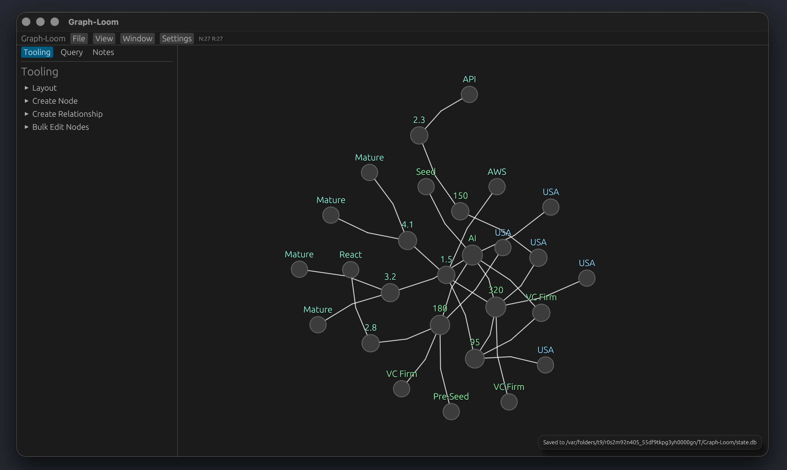
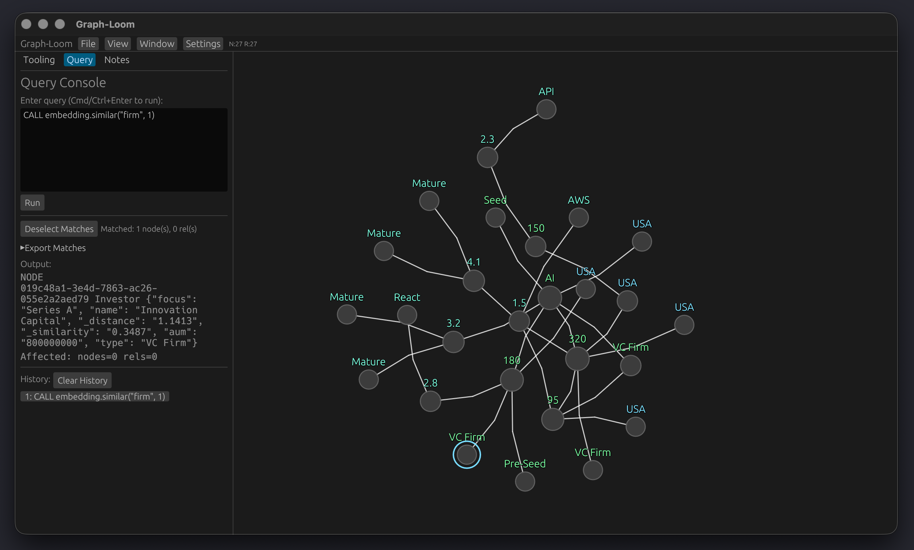
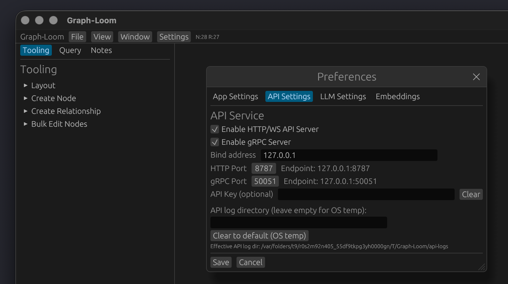
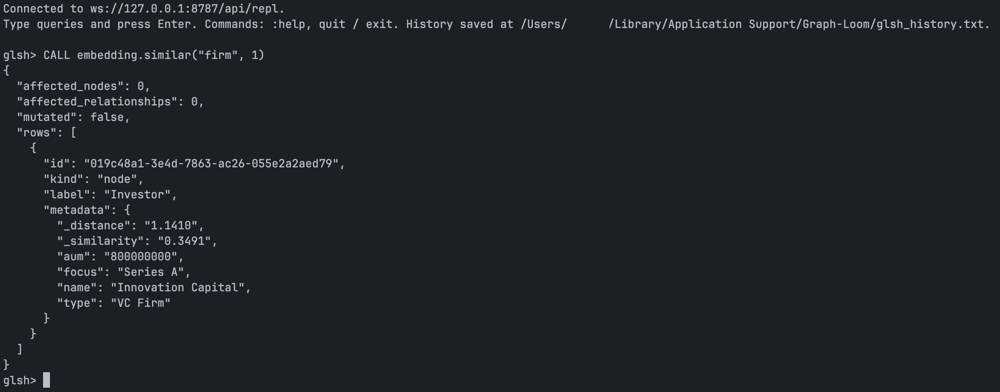
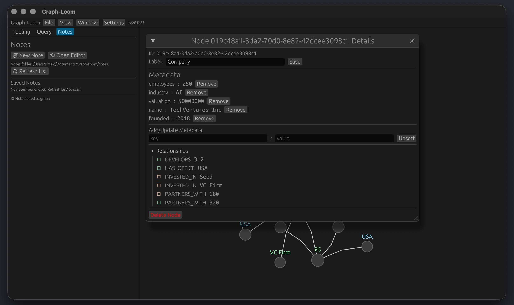
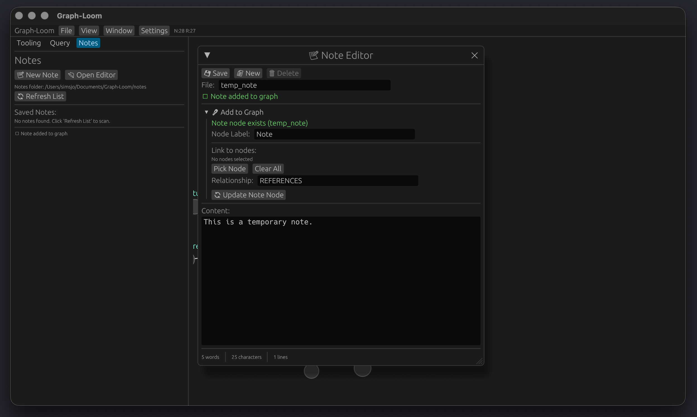

# Graph-Loom

A lightweight, local-first graph notebook and visualizer built with Rust and egui. Features physics-assisted layout, OpenCypher query support, embedded API servers, and enterprise-grade analytics.



## Key Features

- **Physics-Assisted Layout:** Auto-clustering with smooth interaction for hundreds of nodes
- **OpenCypher Query Console:** Full support for MATCH, CREATE, MERGE, SET, DELETE, WHERE, RETURN, WITH, UNWIND
- **Graph Algorithms:** PageRank, Betweenness Centrality, Shortest Path, A* Pathfinding
- **Temporal Queries:** Time-travel visualization with timestamp-based filtering
- **Local Embeddings:** TF-IDF based semantic similarity search (no external API required)
- **LLM Integration:** Optional OpenAI/Anthropic/Ollama support for entity extraction
- **Embedded APIs:** HTTP, WebSocket, and gRPC interfaces for automation
- **SQLite Storage:** ACID-compliant persistence with FTS5 full-text search
- **Local-First:** All data stored locally with automatic backups

---

## Installation

### Prerequisites
- [Rust toolchain](https://www.rust-lang.org/tools/install) (stable, edition 2024)

### Build from Source

```bash
    # Clone the repository
    git clone https://github.com/jackpots28/Graph-Loom.git
    cd Graph-Loom
    
    # Build and run (release mode recommended)
    cargo run --release
```

### Build with CLI Shell

```bash
    # Build both GUI and CLI tools
    cargo build --release --features cli --bin glsh --bin Graph-Loom
```

---

## Quick Start

### Creating Nodes and Relationships

Using the **Query Console** (sidebar → Query tab):

```cypher
    -- Create nodes
    CREATE (p:Person {name: 'Alice', role: 'Engineer'})
    CREATE (c:Company {name: 'TechCorp', industry: 'Software'})
    
    -- Create relationship
    CREATE (p)-[:WORKS_AT {since: '2020'}]->(c)
```

Or use the **sidebar tools** for point-and-click creation.

### Querying Data

```cypher
    -- Find all people
    MATCH (p:Person) RETURN p
    
    -- Find relationships
    MATCH (p:Person)-[r:WORKS_AT]->(c:Company)
    WHERE p.name = 'Alice'
    RETURN p, r, c
    
    -- Pattern matching with filters
    MATCH (n) WHERE n.name CONTAINS 'Tech' RETURN n
```

---

## Query Language Reference

### OpenCypher Support

| Clause | Description | Example |
|--------|-------------|---------|
| `MATCH` | Find patterns | `MATCH (n:Person) RETURN n` |
| `CREATE` | Create nodes/relationships | `CREATE (n:Label {key: 'value'})` |
| `MERGE` | Create if not exists | `MERGE (n:Person {name: 'Bob'})` |
| `WHERE` | Filter results | `WHERE n.age > 30` |
| `RETURN` | Output results | `RETURN n.name, n.age` |
| `SET` | Update properties | `SET n.status = 'active'` |
| `REMOVE` | Delete properties | `REMOVE n.temp_field` |
| `DELETE` | Delete nodes/relationships | `DELETE n` |
| `DETACH DELETE` | Delete with relationships | `DETACH DELETE n` |
| `WITH` | Chain queries | `WITH n ORDER BY n.name` |
| `UNWIND` | Expand lists | `UNWIND [1,2,3] AS x` |
| `ORDER BY` | Sort results | `ORDER BY n.name DESC` |
| `SKIP/LIMIT` | Pagination | `SKIP 10 LIMIT 5` |
| `DISTINCT` | Unique results | `RETURN DISTINCT n.label` |

### WHERE Operators

```cypher
    -- Comparison
    WHERE n.age > 30 AND n.status = 'active'
    WHERE n.name <> 'Unknown'
    
    -- String operations
    WHERE n.name CONTAINS 'Smith'
    WHERE n.name STARTS WITH 'A'
    WHERE n.name ENDS WITH 'son'
    
    -- Null checks
    WHERE n.email IS NOT NULL
    WHERE n.phone IS NULL
    
    -- List membership
    WHERE n.role IN ['Admin', 'Manager']
    
    -- Logical
    WHERE n.active = true OR n.role = 'Admin'
    WHERE NOT n.archived
```

---

## Graph Algorithms

Access via `CALL` procedures in the Query Console:

### PageRank (Node Importance)
```cypher
    CALL algo.pageRank()
    -- Returns nodes sorted by importance score
```

### Betweenness Centrality (Bridge Detection)
```cypher
    CALL algo.betweenness()
    -- Identifies nodes that connect different graph regions
```

### Shortest Path
```cypher
    CALL algo.shortestPath("node-uuid-1", "node-uuid-2")
    -- Returns path between two nodes
```

### A* Pathfinding
```cypher
    CALL algo.astar("from-uuid", "to-uuid")
    -- Heuristic-based pathfinding using node positions
```

### All Paths
```cypher
    CALL algo.allPaths("from-uuid", "to-uuid", 5)
    -- Find all paths up to depth 5
```

### Levenshtein Distance (Fuzzy String Matching)
```cypher
    CALL string.levenshtein("search text", 2)
    -- Find nodes within edit distance 2 (default)
    
    CALL string.levenshtein("search text", 3, "name")
    -- Search specific field with custom max distance
```
Returns `_levenshtein_distance` and `_matched_field` in metadata.

---

## Temporal Queries

Nodes and relationships include `created_at` and `updated_at` timestamps.

### Timeline
```cypher
    CALL temporal.timeline()
    -- Returns chronological list of all graph events
```

### Timestamp Range
```cypher
    CALL temporal.range()
    -- Returns min/max timestamps in the graph
```

### Nodes in Time Range
```cypher
    CALL temporal.nodesInRange(1704067200000, 1706745600000)
    -- Find nodes created within Unix timestamp range (milliseconds)
```

### Graph State at Time
```cypher
    CALL temporal.atTime(1705000000000)
    -- Returns graph state as it existed at that timestamp
```

---

## Semantic Search & Embeddings

### Local Embeddings (No API Required)

Graph-Loom includes local embeddings for semantic similarity with three options:

- **ONNX** (default): Best quality using all-MiniLM-L6-v2 transformer model. Downloads ~90MB on first use.
- **TF-IDF**: Fast, lightweight term-frequency based vectors, no downloads required
- **Word2Vec**: Learns semantic word relationships from your graph data (pure Rust implementation)

Configure in **Preferences → Embeddings** to switch between models. On startup, if the node_embeddings table is empty, all nodes are automatically re-embedded using the selected model.



#### ONNX Examples (Default - Best Quality)
```cypher
    -- High-quality semantic search using transformer embeddings
    CALL embedding.similar("machine learning engineer", 10)
    
    -- Understands synonyms and related concepts
    CALL embedding.threshold("software development", 0.7)
```

#### TF-IDF Examples
```cypher
    -- Find nodes with similar keywords
    CALL embedding.similar("database engineer", 10)
    
    -- Good for exact term matching
    CALL embedding.threshold("python developer", 0.3)
```

#### Word2Vec Examples
```cypher
    -- Find semantically related nodes (understands word relationships)
    CALL embedding.similar("machine learning", 10)
    -- May return nodes about "AI", "neural networks", "deep learning"
    
    -- Find neighbors of a node by semantic similarity
    CALL embedding.neighbors("node-uuid", 5)
    
    -- Discover related concepts above similarity threshold
    CALL embedding.threshold("data science", 0.5)
```

Word2Vec learns that words appearing in similar contexts are related, enabling discovery of semantic relationships between nodes even when they don't share exact terms.

#### Fast Approximate Search (HNSW)
```cypher
    CALL embedding.ann("search text", 10)
    -- O(log n) approximate nearest neighbor search using HNSW index
```
Faster than exact search for large graphs. Results include `_search_type: hnsw_ann` in metadata.

#### Re-Embedding
```cypher
    CALL embedding.reembed()
    -- Clears and rebuilds all embeddings using the selected model
```
Use this after changing the embedding model in Preferences, or click "Re-Embed All Nodes" in **Preferences → Embeddings**.

Results include `_similarity` (cosine) and `_distance` (L2) in metadata.

### Full-Text Search
```cypher
    CALL db.search("search query")
    -- Searches node labels and metadata
```

### Graph Schema
```cypher
    CALL db.schema()
    -- Returns labels, relationship types, and query suggestions
```

### LLM-Powered Entity Extraction

Configure in **Preferences → LLM Settings**:

```cypher
    CALL semantic.extract("John works at Acme Corp as a senior developer")
    -- Extracts entities using configured LLM or heuristic fallback
```

Supported providers: OpenAI, Anthropic, Ollama (local)

---

## API & Integration

### Enable APIs

Go to **Settings → Preferences → API Settings**:



- **HTTP/WebSocket:** Default `127.0.0.1:8787`
- **gRPC:** Default port `50051`
- **API Key:** Optional authentication

### HTTP API

```bash
    curl -X POST http://127.0.0.1:8787/api/query \
      -H "Content-Type: application/json" \
      -H "X-API-Key: your-key" \
      -d '{"query": "MATCH (n) RETURN n LIMIT 10"}'
```

### Health Check

```bash
    curl http://127.0.0.1:8787/health
    # Returns: {"status":"healthy","components":{...},"version":"1.15.1"}
```

### Prometheus Metrics

```bash
    curl http://127.0.0.1:8787/metrics
    # Returns Prometheus-compatible metrics:
    # graph_loom_queries_total{status="success"} 42
    # graph_loom_queries_total{status="error"} 3
    # graph_loom_query_duration_seconds_sum 12.5
    # graph_loom_api_up 1
    # graph_loom_nodes_total 150
    # graph_loom_relationships_total 200
```

### WebSocket REPL

Connect to `ws://127.0.0.1:8787/ws` for interactive queries.

### gRPC

High-performance interface using Protocol Buffers. See `proto/graph_loom.proto` for schema.

**Available RPCs:**
- `Execute(QueryRequest) -> QueryResponse` - Standard request/response
- `ExecuteStream(QueryRequest) -> stream QueryRow` - Streaming for large result sets

### CLI Shell (glsh)

```bash
    # Build CLI
    cargo build --features cli --bin glsh
    
    # Connect to running instance
    ./target/debug/glsh --host 127.0.0.1 --port 8787
```

The CLI provides an interactive REPL for executing queries against a running Graph-Loom instance:



### Python Client

Example client in `examples/python_client/`. See [Python Client README](examples/python_client/README.md).

---

## Headless Mode

Run as a pure API server without GUI:

```bash
    ./target/release/Graph-Loom --background --api-enable
```

### Command Line Options

| Flag | Description |
|------|-------------|
| `--background`, `-b` | Run without GUI (background/headless mode) |
| `--api-enable` | Enable HTTP/WebSocket API |
| `--api-bind <addr>` | Bind address (default: 127.0.0.1) |
| `--api-port <port>` | HTTP port (default: 8787) |
| `--api-key <key>` | Set API authentication key |
| `--grpc-enable` | Enable gRPC server |
| `--grpc-port <port>` | gRPC port (default: 50051) |

---

## User Interface

### Canvas Navigation
- **Pan:** Drag background
- **Zoom:** Scroll wheel (cursor over canvas)
- **Select:** Click node/relationship
- **Multi-select:** Rectangle drag or Shift+click

### Sidebar Modes
- **Tooling:** Node/relationship creation, layout controls
- **Query:** OpenCypher console with autocomplete
- **Notes:** Markdown notes linked to graph nodes

### Node Details

Click on any node to view and edit its details, metadata, and relationships:



### Note Editor

Create and manage markdown notes that can be linked to graph nodes:



### Keyboard Shortcuts
- **Ctrl/Cmd+S:** Save
- **Ctrl/Cmd+Space:** Force autocomplete popup
- **Tab/Enter:** Accept autocomplete suggestion
- **Escape:** Dismiss autocomplete/dialogs
- **Arrow keys:** Navigate autocomplete suggestions

### Query Autocomplete

The query console provides IDE-style autocomplete:
- Type to filter suggestions
- Arrow keys to navigate
- Tab/Enter to accept
- Trailing space hides suggestions
- Ctrl/Cmd+Space shows all options

---

## Data Storage

### SQLite Backend (Default)

- **Location:** OS-specific app data directory
- **File:** `state.db`
- **Features:** ACID compliance, FTS5 full-text search, R-tree spatial indexing

### Performance Optimizations

- **WAL Mode:** Write-Ahead Logging for 10-100x faster writes and concurrent reads
- **Query Plan Caching:** LRU cache (1000 plans) reduces parse overhead for repeated queries
- **Property Indexes:** B-tree indexes on metadata for fast property lookups
- **Incremental Embeddings:** Add/remove nodes without full index rebuild
- **Batch Operations:** Optimized bulk imports (1000-10000 items per transaction)

### Versioned Backups

Automatic timestamped backups in RON format for human readability.

### Settings

Stored in `settings.json`:
- macOS: `~/Library/Application Support/Graph-Loom/`
- Windows: `%APPDATA%\Graph-Loom\`
- Linux: `~/.config/Graph-Loom/`

---

## System Tray & Background Mode

When API/gRPC is enabled:
- **Close to Tray:** Window hides, service continues running
- **Tray Menu:** Show window or quit application
- **Multi-Instance Detection:** Second launch brings existing instance to foreground
- **CPU Efficiency:** Near-zero CPU when backgrounded

---

## Contributing

### Development Setup

```bash
    git clone https://github.com/jackpots28/Graph-Loom.git
    cd Graph-Loom
    cargo build
```

### Running Tests

```bash
    cargo test
    cargo test algorithms
    cargo test temporal
    cargo test embeddings
```

### Code Style

- Follow existing patterns in the codebase
- Use `cargo fmt` before committing
- Run `cargo clippy` for lints

### Pull Requests

1. Fork the repository
2. Create a feature branch
3. Make changes with tests
4. Submit PR with clear description

---

## Project Structure

```
    src/
    ├── api/                    # HTTP, WebSocket, gRPC servers
    │   ├── auth.rs             # Authentication & RBAC
    │   ├── grpc.rs             # gRPC service
    │   └── server.rs           # HTTP/WebSocket server
    ├── gql/                    # Query language
    │   ├── cypher_spec.rs      # OpenCypher parser
    │   └── query_interface.rs  # Query execution
    ├── graph_utils/            # Core graph operations
    │   ├── algorithms.rs       # PageRank, centrality, pathfinding
    │   ├── graph.rs            # Node/Relationship structures
    │   └── temporal.rs         # Time-travel queries
    ├── gui/                    # User interface
    │   └── frontend.rs         # egui application
    ├── persistence/            # Data storage
    │   ├── persist.rs          # Save/load logic
    │   ├── settings.rs         # App configuration
    │   └── sqlite_backend.rs   # SQLite storage
    ├── semantic/               # AI/ML features
    │   ├── embeddings.rs       # Local TF-IDF embeddings
    │   ├── extraction.rs       # Entity extraction
    │   ├── llm_client.rs       # LLM API client
    │   └── rag.rs              # Graph RAG
    └── main.rs                 # Application entry point
```

---

## License

[Apache 2.0](LICENSE)

---

## Acknowledgments

Built with:
- [egui](https://github.com/emilk/egui) - GUI
- [rusqlite](https://github.com/rusqlite/rusqlite) - SQLite bindings
- [tonic](https://github.com/hyperium/tonic) - gRPC framework
- [actix-web](https://actix.rs/) - HTTP server
